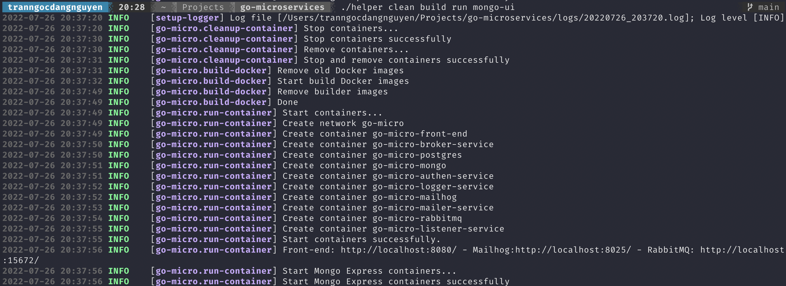
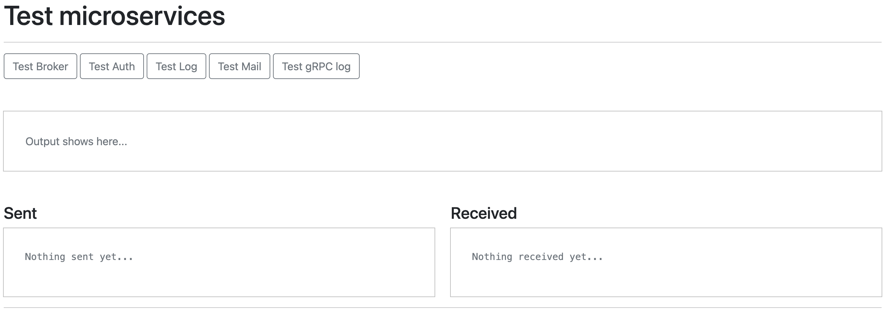

# Go Microservices

Mini project microservices with Golang

## 🔰 Technologies 🔰

- Go
- Docker
- Kubernestes
- PostgreSQL
- Mongo
- RPC
- gRPC
- Rabbitmq
- Mailhog

## 🔰 Architecture 🔰
 
 TBD

## 🔰 How to build and run 🔰

### 🐳 Docker 🐳

#### Using Docker Compose

Deploy project with [Docker Compose](https://docs.docker.com/compose/)
#### Using automation script

**Using with Bash verion >= 4** *(To check Bash version, use: bash --version)*

1. Go to source code folder.
2. **❗️IMPORTANT:** Update submodule ```git submodule update --init --recursive```
3. Grant permission ```chmod +x helper```
4. Run helper's help menu ```./helper help```
5. Happy deploying





### 🚢 Kubernetes 🚢

TBD